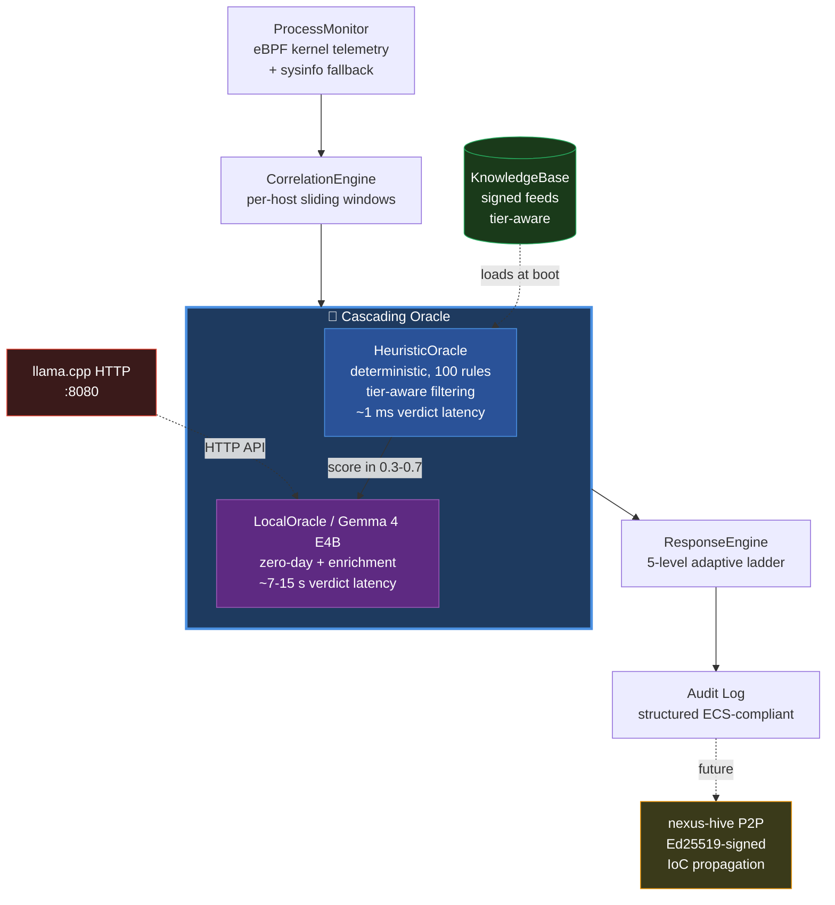

# 🛡️ NEXUS AIEDR

**AI-powered Endpoint Detection & Response, engineered for air-gapped environments.**

*Heuristic precision meets local LLM reasoning — zero cloud dependencies, full data sovereignty.*

---

## 🎯 What is NEXUS?

NEXUS is a next-generation **EDR/XDR platform** written in Rust that combines two detection engines in a unique cascading architecture:

1. **Deterministic heuristic rules** — sub-millisecond detection of known attack patterns (100 curated rules across 8 detection families, 50+ MITRE ATT&CK techniques)
2. **Local AI reasoning** — Gemma 4 LLM running entirely on-premise for zero-day detection, false-positive triage, and contextual threat naming

**No cloud. No telemetry leaks. No vendor lock-in.** Designed for environments where data sovereignty is non-negotiable: financial institutions, defense, healthcare, critical infrastructure, and regulated EU markets (GDPR, NIS2, eIDAS).

---

## 🚀 Why NEXUS?

| Problem | Traditional EDR | NEXUS |
|---------|-----------------|-------|
| Zero-day detection | Cloud ML — telemetry leaves the perimeter | Local LLM — bytes never leave the perimeter |
| False-positive fatigue | Threshold tuning hell | AI-enriched verdicts with reasoning |
| Air-gapped environments | Not supported / degraded mode | First-class citizen |
| Vendor lock-in | $50–200 per endpoint per year SaaS | Self-hosted, source-available |
| GDPR / NIS2 compliance | Requires DPIA + DPA per region | Compliant by architecture |

---

## ⚡ Key Differentiators

- 🧠 **Cascading Oracle** — Heuristic primary (1 ms deterministic) + LocalOracle/Gemma 4 secondary for ambiguous events. Verdicts are intelligently merged, never ping-ponged.
- 🔒 **100% Local Inference** — Gemma 4 E4B Q8 runs via embedded `llama.cpp` HTTP server. No outbound API calls. Verifiable with `tcpdump`.
- 🎯 **Adaptive Response Ladder** — 5-level severity (`LOG → ALERT → THROTTLE → KILL → ISOLATE`), proportional to confidence × score.
- 🔗 **Per-host Correlation Engine** — Sliding windows with bounded memory, lock-free concurrent absorption, idle-host eviction.
- 🛡️ **Graceful Degradation** — If the AI server is unreachable, NEXUS falls back to heuristic-only mode without service interruption.
- 📡 **Future-ready P2P mesh** — `nexus-hive` will let peer agents share IoCs over Ed25519-signed beacons (no central management server required).

---

## 🏗️ Architecture

---

## 🚦 Project Status

> **NEXUS source code is currently in a private pre-release repository.**
> Public source release is planned **as soon as the project reaches production-ready quality**.

This repository hosts the **public-facing documentation** — architecture, detection coverage,
and roadmap — for transparency with the security community while the project matures.

### What you can see today

- ✅ Full architecture and design rationale
- ✅ Complete list of 100 detection rules with MITRE mappings
- ✅ Threat intelligence references (CVEs, APT campaigns)
- ✅ Roadmap and milestone history
- ✅ Tech stack and performance metrics

### What is not yet public

- 🔒 Source code (`nexus-core`, `nexus-agent`, `nexus-hive` crates)
- 🔒 Pre-built binaries
- 🔒 Detection rule definitions in machine-readable format

### Interested in early access?

If you represent a security team, research lab, or organization with a use case that aligns with NEXUS (air-gapped EDR, sovereign cloud, regulated industry), reach out via the [Contact](#-contact) section below.

---

## 🎯 Detection Coverage

NEXUS ships with **100 curated detection rules** spanning the most common Linux attack patterns observed in 2024–2026 incident response reports. Every rule includes:

- ✅ A unique `NEX-*` identifier for tracking and tuning
- ✅ A MITRE ATT&CK technique mapping (50+ unique techniques covered)
- ✅ A maturity tag (`stable` / `beta`) reflecting field validation
- ✅ An author tag for accountability

| Family | Count | MITRE Tactic | Highlights |
|--------|------:|--------------|------------|
| **Windows core** | 3 | TA0002 / TA0006 | PowerShell encoded, hidden window, Office macro |
| **Linux core** | 10 | TA0002 / TA0011 | Reverse shells, cryptominers, base64 staging, netcat |
| **CanisterWorm Suite** | 5 | TA0001 / TA0003 | Supply-chain worm (TeamPCP, March 2026): npm hooks, ICP canister C2, `deploy.js` self-propagation |
| **Initial Access** | 15 | TA0001 / TA0002 | Web/DB/mail RCE patterns (Log4Shell, Spring4Shell, CVE-2024-4577), container escape (CVE-2024-21626 runc), LOLBins, scripting interpreters |
| **Persistence** | 12 | TA0003 | systemd / cron / `.bashrc` / `LD_PRELOAD` / `authorized_keys` / `sshd_config` backdoors |
| **Privilege Escalation & Defense Evasion** | 10 | TA0004 / TA0005 | SUID/SGID, sudoers, kernel exploits (PwnKit, DirtyPipe, OverlayFS), capability abuse, log tampering, MAC disable |
| **Credential Access & Discovery** | 10 | TA0006 / TA0007 | `/etc/shadow`, browser cred DBs, SSH keys, AWS/GCP/Azure creds, kubeconfig, `/proc` memory dump, post-exploit toolkits |
| **Lateral Movement, C2 & Exfiltration** | 13 | TA0008 / TA0011 / TA0010 | SSH brute-force, agent forwarding, DNS tunneling, Tor, ngrok/cloudflared, socat, rclone, crypto wallets, Discord/Slack webhook exfil |
| **Total** | **100** | | |

### Threat Intelligence References

Rules are not invented — every detection is backed by published research, CVEs, or documented APT campaigns:

- **CVE references**: CVE-2021-4034 (PwnKit), CVE-2022-0847 (DirtyPipe), CVE-2023-2640 (OverlayFS), CVE-2024-21626 (runc), CVE-2024-4577 (PHP-CGI), CVE-2019-10149 (Exim), CVE-2021-44228 (Log4Shell), CVE-2022-22965 (Spring4Shell)
- **Threat actors**: TeamPCP, Outlaw, Kinsing, TeamTNT, RotaJakiro, XorDDoS, APT29, Turla, APT41, Lazarus
- **Campaigns**: CanisterWorm (JFrog/Socket/Aikido, 2026), GlassWorm, Shai-Hulud
- **Frameworks**: MITRE ATT&CK v15, GTFOBins, PayloadsAllTheThings

---

## 🆚 NEXUS vs Existing Solutions

| Capability | Wazuh | Falco | CrowdStrike Falcon | **NEXUS** |
|-----------|:-----:|:-----:|:-----:|:-----:|
| Open / source-available | ✅ | ✅ | ❌ | ✅ |
| Local AI reasoning | ❌ | ❌ | Cloud only | ✅ |
| Air-gapped operation | ⚠️ | ✅ | ❌ | ✅ |
| Deterministic rules | ✅ (2000+ OSSEC) | ✅ (~50) | ✅ | ✅ (100 curated) |
| Per-rule MITRE mapping | Partial | Partial | ✅ | ✅ |
| Cascading verdict (heuristic + AI) | ❌ | ❌ | ❌ | ✅ |
| P2P mesh telemetry | ❌ | ❌ | ❌ | 🚧 (planned) |
| Cost per endpoint per year | Free | Free | $50–200 | TBD |
| Memory-safe language | C / Python | Go / C++ | C++ | **Rust** |

---

## 🛣️ Milestone History

A transparent log of development progress.

### ✅ Milestone 1 — Foundations
- Workspace skeleton (`nexus-core`, `nexus-agent`, `nexus-hive`)
- ECS-compliant event schema (`EcsEvent`, `EventBuilder`)
- Ed25519 signed envelope (`crypto.rs`) for trustworthy KB updates
- Initial 5-rule detection set (Windows-only)

### ✅ Milestone 2 — Heuristic Oracle
- `Oracle` trait abstraction (async, generic verdict format)
- `HeuristicOracle` implementation: deterministic, sub-millisecond
- `KnowledgeBase` with versioning and IoC categorization
- 13 detection rules (3 Windows + 10 Linux core)

### ✅ Milestone 3 — Process Telemetry
- `ProcessMonitor` via `sysinfo` polling (1 Hz default)
- ECS conversion (`ProcessInfo` → `EcsEvent`)
- Live event production tested on Linux + WSL2

### ✅ Milestone 4 — Correlation Engine
- Per-host sliding windows with bounded memory
- Lock-free concurrent absorption
- Idle-host eviction (configurable TTL)
- 14 unit tests covering eviction, suppression, race conditions

### ✅ Milestone 5 — Adaptive Response Engine
- 5-level severity ladder: `LOG → ALERT → THROTTLE → KILL → ISOLATE`
- Dry-run mode for safe staging
- Audit-grade structured logging via `tracing`

### ✅ Milestone 6 — LocalOracle / Gemma 4 Integration
- HTTP client to embedded `llama.cpp` server
- JSON schema-constrained generation (deterministic structure)
- Verdict normalization (clamp scores, MITRE validation)
- Live-tested on AMD Ryzen 9 / 32 GB RAM, no GPU

### ✅ Milestone 7 — Cascading Oracle Architecture
- Two-stage verdict pipeline: heuristic primary + LocalOracle secondary
- Confidence-weighted score merging (0.6 primary / 0.4 secondary)
- Graceful fallback if LLM server unreachable
- Full audit trail of both verdicts in single ECS record

### ✅ Milestone 8 — Detection Coverage Expansion
- **Detection KB grown 6x: from 13 to 78 rules**
- 5 strategic families added: CanisterWorm Suite, Initial Access, Persistence, Privilege Escalation, Credential Access, Lateral Movement
- 50+ unique MITRE ATT&CK techniques covered
- Real-world threat intel references for every rule (CVEs, APT campaigns, security vendor reports)
- LocalOracle bug fix: empty-reasoning fallback for benign events
- Test suite expanded to **96 passing tests** (87 unit + 9 integration)

### ✅ Milestone 9 — Detection Coverage Hardening
- 100 detection rules total (Linux + Windows families)
- 4-tier capability system (Free / Pro / Business / Enterprise)
- 8 false-positive fixes from real-world audit
- 87 unit tests + 9 integration tests

### ✅ Milestone 10 — eBPF Kernel Telemetry

- BPF tracepoint on `sched/sched_process_exec` (kernel 5.7+)
- Process events captured with sub-millisecond latency
- `aya` 0.13 toolchain (Rust nightly + bpf-linker)
- **Full ProcessInfo capture (Phase 4.5):** PID, PPID, comm, executable path, timestamp
  - PPID resolved kernel-side via CO-RE access to `task_struct`
  - Executable path resolved userspace-side via `/proc/<pid>/exe` (kernel-side path resolution moves to M11 BPF LSM where it is allowed)
- Runtime detection: BPF when available, sysinfo polling as universal fallback
- Verified live end-to-end: events flow kernel → BpfProcessMonitor → CorrelationEngine → CascadingOracle, zero events dropped

### 🟢 Milestone 11 — BPF LSM Enforcement *(5/6 sub-phases done, 83%)*

Active execve gating via BPF LSM hooks (`bprm_check_security`, kernel 5.7+).
The full ALERT mode pipeline is wired and production-tested; BLOCK mode is
deferred to a VM-only sub-phase due to the safety surface of kernel-level
exec refusal.

- ✅ **M11.1** — LSM hook scaffold + ring-buffered event channel
- ✅ **M11.2** — Kernel-side executable path resolution via `bpf_d_path`
- ✅ **M11.3** — Allowlist / denylist BPF policy maps, sub-microsecond lookup
- ✅ **M11.4** — Agent runtime integration: M10 tracepoint + M11 LSM events share a unified `EcsEvent` channel, correlated by PID
- ✅ **M11.5** — ALERT mode end-to-end: structured `enforcement` field on every event, `CascadingOracle` fast-path that skips both heuristic and AI evaluation on `Allowlisted` (suppress) and `Denied` (high-confidence policy violation verdict). Saves ~10s per denylist hit by avoiding the AI call. Stress tested at ~143 events/sec sustained, zero event loss.
- 🔒 **M11.6** — BLOCK mode + safety guards (refuse-to-block list, emergency-disable file, recovery procedure). Deferred to a VM-only session because a bug in BLOCK mode can render a host unbootable.

### 🔜 Milestone 12 — Threat Model & Self-Protection *(planned)*
- Formal `THREAT_MODEL.md` documenting attack vectors and mitigations
- Watchdog: systemd `Restart=always`, KB SHA256 verification at boot
- Process integrity self-check
- Kernel-level protection groundwork

---

## 🛠️ Tech Stack

| Layer | Technology | Why |
|-------|-----------|-----|
| Language | **Rust 1.95+** | Memory safety, performance, zero-cost abstractions |
| Async runtime | Tokio | De-facto standard for async Rust |
| LLM | **Gemma 4 E4B Q8_0** (4B params) | Best tradeoff between local-runnable size and reasoning quality |
| LLM serving | `llama.cpp` HTTP server | Mature, CPU-friendly, OpenAI-compatible API |
| Process telemetry | `aya` eBPF (kernel 5.7+) + `sysinfo` fallback | Sub-millisecond capture via BPF, universal fallback when BPF unavailable |
| Crypto | `ring` (Ed25519 signatures, SHA-256) | Audited, BoringSSL-backed. Integrity-first design. |
| Schema | Elastic Common Schema 8.11 | Industry-standard interoperability |
| Logging | `tracing` (structured) | Production-grade observability |
| Serialization | `serde` + `serde_json` | Standard Rust ecosystem |

---

## 📋 Current Status

🟢 **Pre-release v0.3 — Milestone 11 almost complete (5/6 sub-phases done)**

| Metric | Value |
|--------|-------|
| Detection rules | **100** |
| MITRE techniques covered | **50+** |
| Test coverage | **100 tests passing** (91 unit + 9 integration) |
| Codebase size | ~10,140 lines of Rust |
| Supported OS | Linux (Ubuntu 22.04+, WSL2 verified). Windows planned future release |
| Detection latency (heuristic) | < 1 ms |
| Detection latency (LocalOracle, CPU) | 7–15 s on Ryzen 9 3900XT |
| Memory footprint (agent) | ~30 MB without LLM |
| Memory footprint (LLM) | ~11 GB (Gemma 4 E4B Q8) |

---

## 📬 Contact

For early-access evaluation, threat intelligence collaboration, or commercial licensing inquiries:

- 🔗 **GitHub**: [@nexus-aiedr](https://github.com/nexus-aiedr)
- 💼 **LinkedIn**: *coming soon*
- 📧 **Email**: *coming soon*

> Currently building solo from Italy 🇮🇹. Responses may take 1–3 business days.

---

## 📜 License

**Proprietary. All rights reserved.**

NEXUS will transition to a dual-license model (AGPLv3 + commercial) upon public release. Until then, all source code is provided for evaluation only and may not be redistributed.

---

## ⚠️ Disclaimer

NEXUS is **pre-release software** under active development. Detection rules are validated against published threat intelligence, but no detection system can guarantee 100% coverage of unknown threats. Use in production environments at your own risk and always pair with defense-in-depth practices.

---

**Built in Rust. Engineered for sovereignty. Designed for the AI era.**

🇮🇹 Made with care in Italy

